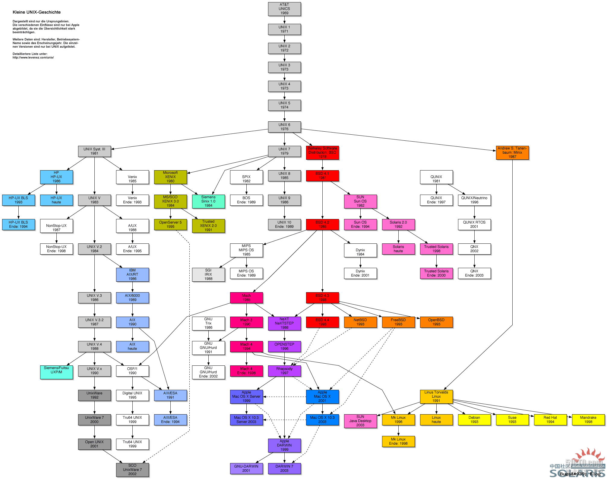
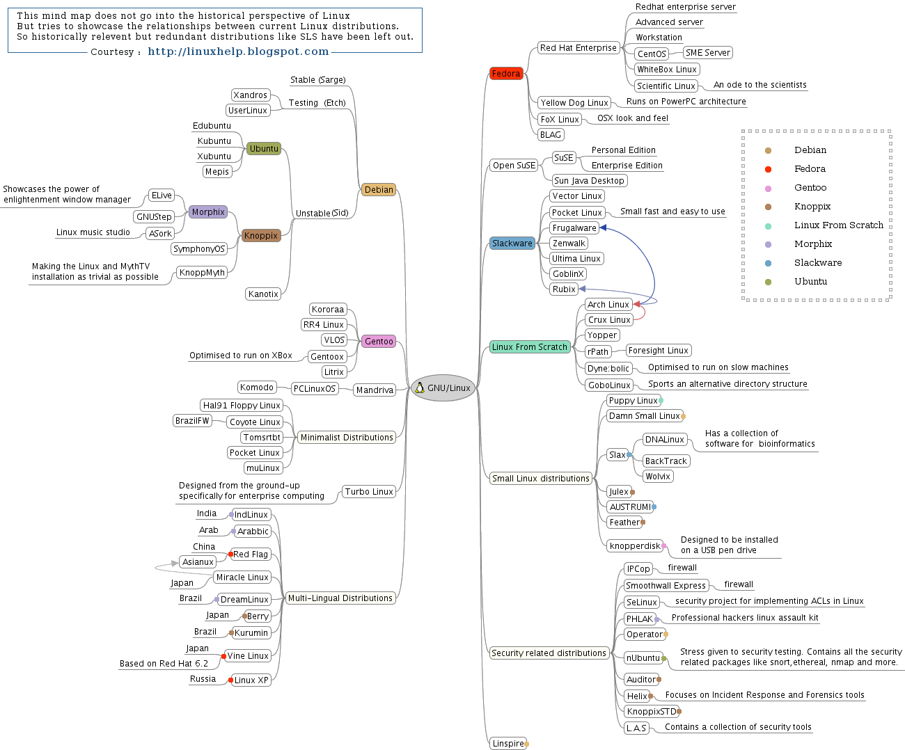
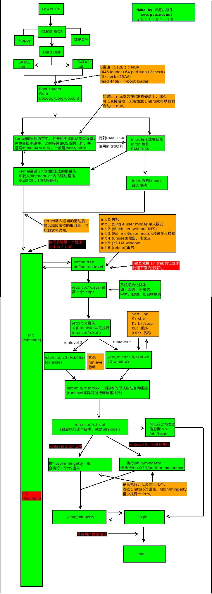
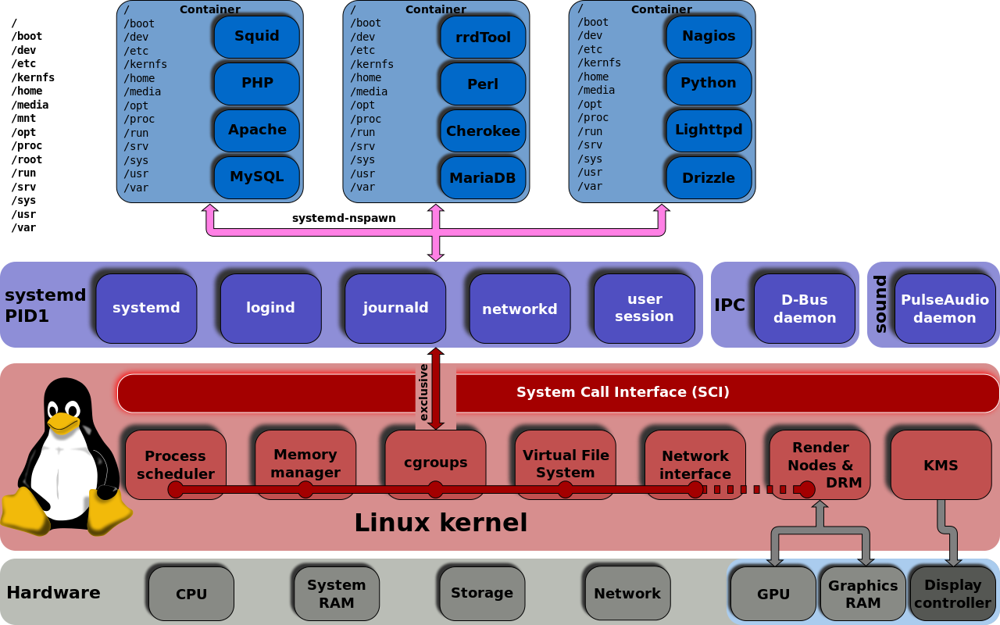
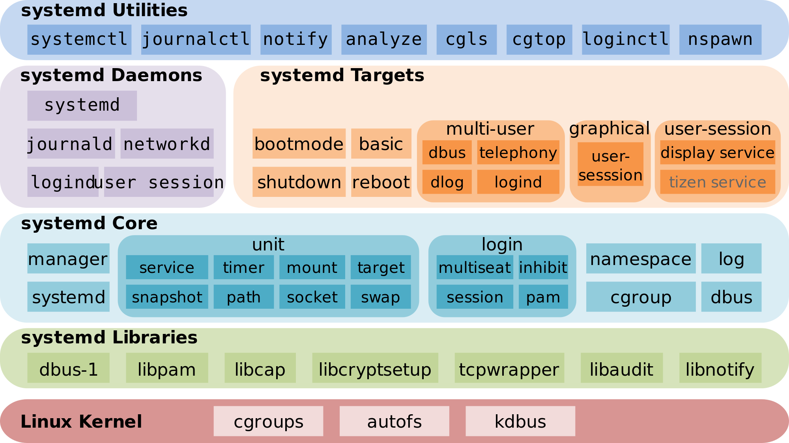

# 目录
* [Unix & Linux 发展简史](#n1)
* [Linux 启动过程](#n2)
* [Linux 第一个进程 SysV init, Upstart, Systemd](#n3)
* [Systemd 功能介绍](#n4)
* [Systemctl 命令简介](#n5)
* [Unit service 配置文件简介](#n6)
* [Shadowsocket.service 示例](#n7)


# <a name="n1"></a>Unix & Linux 发展简史
### UNIX 名字来源 (一个游戏和玩笑创造出来)
1965麻省理工决定开发一个大型的分时计算机系统，于是麻省理工学院找到通用电子公司,贝尔电话实验室开始一个叫做**MULTICS(Multiplexed Information and Computing Service)**的项目，1969年2月，MULTICS 计划在历经四年的奋战后，仍旧未达到原先规划设计的理 想，贝尔电话实验室决定退出计划，项目夭折。在退出贝尔实验室退出计划之后，实验室中的有个叫**Ken Thompson**的人，他为MULTICS这个操作系统写游戏了个叫**Space Travel**的游戏，在MULTICS上经过实际运行后，他发现游戏速度很慢而且耗费昂贵 —— 每次运行会花费75美元。退出这个项目以后。他为了让这个游戏能玩，所以他找来**Dennis Ritchie**为这个游戏开发一个极其简单的操作系统。他们的一个叫**Brian Kernighan**同事非常不喜欢这个系统，嘲笑Ken Thompson说：“你写的系统好真差劲，干脆叫**UNICS**算了。**UNICS**的名字就是相对于**MULTICS**的一种戏称，后来改成了**UNIX**。于是，Unix就在这样被游戏和玩笑创造了，当时是1969年8月。也就是这一年，**Linux**之父**Linus Torvalds**在芬兰出生了。

### UNIX 分支发展历史
  

### UNIX 哲学
Unix遵循的原则是KISS (Keep it simple, stupid)  
* Everything (including hardware) is a file. (所有的事物（甚至硬件本身）都是一个的文件。)  
* Configuration data stored in text. (以文本形式储存配置数据。)  
* Small, single-purpose program. (程序尽量朝向小而单一的目标设计。)   
* Avoid captive user interfaces. (尽量避免令人困惑的用户接口。)  
* Ability to chain program together to perform complex tasks. (将几个程序连结起来，处理大而复杂的工作。)  

### <a name="n2"></a>LINUX 诞生背景
由于贝尔实验室隶属于美国电信大厂AT&T公司的，后来AT&T由于商业的考虑以及在当时实环境下的思考，将UNIX的版权收回去，还特别提到了“不可对学生提供源码”的严格限制。这就对学校里的教导UNIX内核源码相关学问的教授有影响了，没内核源码如何教导学生认识UNIX呢？于是乎，AndrewTanenbaum（谭宁邦）教授自己动手写了Minix这个UNIX Like的内核程序！在编写过程中为了避免版权纠纷，谭宁邦完成不看UNIX内核源码！84年开始编写，86年完成。Minix不是完全免费的，必须通过磁盘/磁带购买才行，但会附上Minix的源码，意味着用户可以学习Minix的内核程序设计概念。  

在后来的几年内，由于计算机硬件工业的强力运作，以intel主导的x86系统架构的个人计算机大行其道，个人计算机算是相当流行的一个机器了！但在此时，人们使用的大多还是需要吃很多系统资源的DOS系列或其它的操作系统。此时，芬兰的郝尔辛基大学 (Helsinki)的一位名叫Linus Torvalds的学生做了件不寻常的事情。Linus手边有个Minix系统(这也是 Unix的分支)，他对这个操作系统相当的有兴趣。此外，由于当时他正好买了一部386的计算机，他想将Minix移植到X86上来，linus向原作者提出一些修改建议，但原作者不接受。受Stallman提倡的Open Source运动的影响，他得以接触到一些source code。在他的努力下，他将Unix改写成可以适用于一般个人计算机的操作系统，到了1991年，他终于将0.02版的hobby放到网络上面供大家下载，并且由于hobby受到大家的肯定，相当多的朋友一起投入这个工作中。终于到了1994年将第一个完整的核心Version 1.0开发完成，并取名Linux。

### LINUX 发行版演变


#### 参考
[https://www.levenez.com/unix/unix.pdf](https://www.levenez.com/unix/unix.pdf)   
[https://www.levenez.com/unix/](https://www.levenez.com/unix/)   
[http://www.path8.net/tn/archives/726](http://www.path8.net/tn/archives/726)   
[http://coolshell.cn/articles/2322.html](http://coolshell.cn/articles/2322.html)   
[http://coolshell.cn/articles/2324.html](http://coolshell.cn/articles/2324.html)   
[http://blog.tingyun.com/web/article/detail/1010](http://blog.tingyun.com/web/article/detail/1010)   


# <a name="n3"></a>Linux 启动过程


```bash
lsinitramfs -l /boot/initrd.img-4.4.0-34-generic
```

#### 参考
[http://molinux.blog.51cto.com/2536040/478704](http://molinux.blog.51cto.com/2536040/478704)   
[https://segmentfault.com/a/1190000006872609](https://segmentfault.com/a/1190000006872609)   

# <a name="n4"></a>Systemd 功能介绍

### Init 替代品
Base Event (Upstart)  
Base Dependence(Systemd)  

### systemd 争议
https://www.zhihu.com/question/25873473   

### 

### Systemd Links
[Software](https://www.freedesktop.org/wiki/Software/systemd/)  
[Systemd Story](http://0pointer.de/blog/projects/systemd.html)
[开发者 Lennart Poettering](https://en.wikipedia.org/wiki/Lennart_Poettering)  

### Linux Distribution default systemd

Linux Distribution | Version
--- | --- 
Fedora | 15
RedHat| 7
CentOS | 7
Debian | 8
ubuntu | 16.04
OpenSUSE | 12.3 
Arch | Yes
Gentoo | Optional

### Systemd 功能



### Unit 类型 
* Service unit：系统服务
* Target unit：多个 Unit 构成的一个组
* Device Unit：硬件设备
* Mount Unit：文件系统的挂载点
* Automount Unit：自动挂载点
* Path Unit：文件或路径
* Scope Unit：不是由 Systemd 启动的外部进程
* Slice Unit：进程组
* Snapshot Unit：Systemd 快照，可以切回某个快照
* Socket Unit：进程间通信的 socket
* Swap Unit：swap 文件
* Timer Unit：定时器

### Systemd Utilities
* bootctl
* busctl
* coredumpctl
* hostnamectl
* journalctl
* localectl
* loginctl
* machinectl
* networkctl
* systemctl
* timedatectl

# <a name="n5"></a>systemctl 命令

#### systemctl list-units命令可以查看当前系统的所有 Unit 
```shell
# 列出正在运行的 Unit
$ systemctl list-units

# 列出所有Unit，包括没有找到配置文件的或者启动失败的
$ systemctl list-units --all

# 列出所有没有运行的 Unit
$ systemctl list-units --all --state=inactive

# 列出所有加载失败的 Unit
$ systemctl list-units --failed

# 列出所有正在运行的、类型为 service 的 Unit
$ systemctl list-units --type=service
```

#### systemctl status命令用于查看系统状态和单个 Unit 的状态
```shell
# 显示系统状态
$ systemctl status

# 显示单个 Unit 的状态
$ sysystemctl status bluetooth.service

# 显示远程主机的某个 Unit 的状态
$ systemctl -H root@rhel7.example.com status httpd.service
```

#### 除了status命令，systemctl还提供了三个查询状态的简单方法，主要供脚本内部的判断语句使用
```shell
# 显示某个 Unit 是否正在运行
$ systemctl is-active application.service

# 显示某个 Unit 是否处于启动失败状态
$ systemctl is-failed application.service

# 显示某个 Unit 服务是否建立了启动链接
$ systemctl is-enabled application.service
```

#### 用于启动和停止 Unit（主要是 service）
```shell
# 立即启动一个服务
$ sudo systemctl start apache.service

# 立即停止一个服务
$ sudo systemctl stop apache.service

# 重启一个服务
$ sudo systemctl restart apache.service

# 杀死一个服务的所有子进程
$ sudo systemctl kill apache.service

# 重新加载一个服务的配置文件
$ sudo systemctl reload apache.service

# 重载所有修改过的配置文件
$ sudo systemctl daemon-reload

# 显示某个 Unit 的所有底层参数
$ systemctl show httpd.service

# 显示某个 Unit 的指定属性的值
$ systemctl show -p CPUShares httpd.service

# 设置某个 Unit 的指定属性
$ sudo systemctl set-property httpd.service CPUShares=500
```

#### systemctl list-dependencies命令列出一个 Unit 的所有依赖
```shell
$ systemctl list-dependencies nginx.service
# 展开 target
$ systemctl list-dependencies --all nginx.service
```

#### 设置和关闭开机启动
```shell
$ sudo systemctl enable nginx.service
$ sudo systemctl disable nginx.service
```

#### systemctl list-unit-files命令用于列出所有配置文件
```shell
# 列出所有配置文件
$ systemctl list-unit-files

# 列出指定类型的配置文件
$ systemctl list-unit-files --type=service
```

#### 参考
http://www.ruanyifeng.com/blog/2016/03/systemd-tutorial-commands.html  
https://www.freedesktop.org/software/systemd/man/  

# <a name="n6"></a>Unit service 配置文件简介
### nginx.service
```ini
[Unit]
Description=A high performance web server and a reverse proxy server
After=network.target

[Service]
Type=forking
PIDFile=/run/nginx.pid
ExecStartPre=/usr/sbin/nginx -t -q -g 'daemon on; master_process on;'
ExecStart=/usr/sbin/nginx -g 'daemon on; master_process on;'
ExecReload=/usr/sbin/nginx -g 'daemon on; master_process on;' -s reload
ExecStop=-/sbin/start-stop-daemon --quiet --stop --retry QUIT/5 --pidfile /run/nginx.pid
TimeoutStopSec=5
KillMode=mixed

[Install]
WantedBy=multi-user.target
```

# <a name="n7"></a>Shadowsocket.service 示例

### ss-server.service
```ini
[Unit]
Description=Shadowsocks Server
After=network.target

[Service]
ExecStart=/usr/local/bin/ss-server -c /usr/local/etc/ss-server.json
ExecReload=/bin/kill -HUP $MAINPID
KillMode=process
Restart=on-failure
RestartPreventExitStatus=255

[Install]
WantedBy=multi-user.target
```

### ss-server.json
```json
{
  "server_port": 8383,
  "method": "aes-256-cfb",
  "password": "welcome@123",
  "timeout": 300
}
```

#### 参考
http://www.jinbuguo.com/systemd/systemd.unit.html   
https://blog.linuxeye.com/400.html  

# 参考
https://access.redhat.com/documentation/en-US/Red_Hat_Enterprise_Linux/7/html/System_Administrators_Guide/chap-Managing_Services_with_systemd.html  

# 备注
### static
Static units are those which cannot be enabled/disabled, but it doesn't mean they are always executed. They will only if another unit depends on them, or if they are manually started.
Actually, static units are simply those without an [Install] section. As enabling units means just creating a symlink to wherever [Install] mandates, those units without [Install] section cannot be enabled, as systemctl doesn't know where to place the symlink.
Of course, you can still manually create a symlink from a static unit to (for instance) /etc/systemd/system/multi-user.target.wants/, and it will be executed as any other enabled unit. But I suppose static units are not intended to be enabled in that way, and most probably you shouldn't need to do it.


```bash
systemd-cgls
ps xawf -eo pid,user,cgroup,args
```


